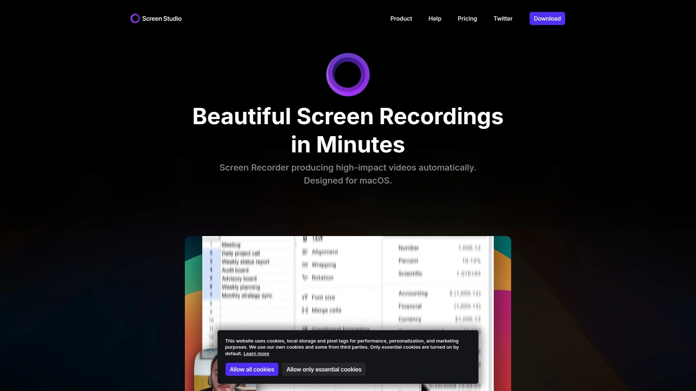
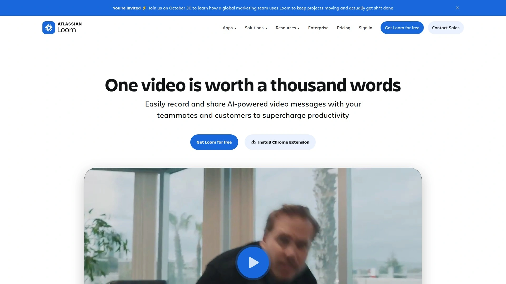
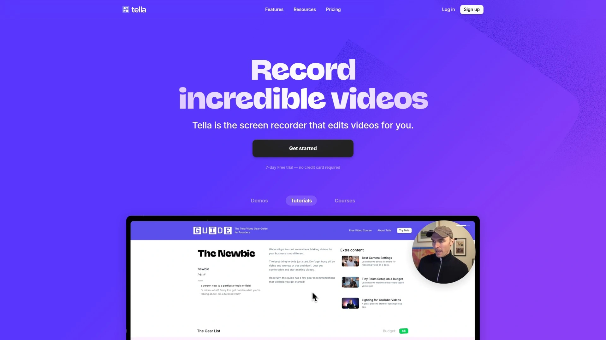
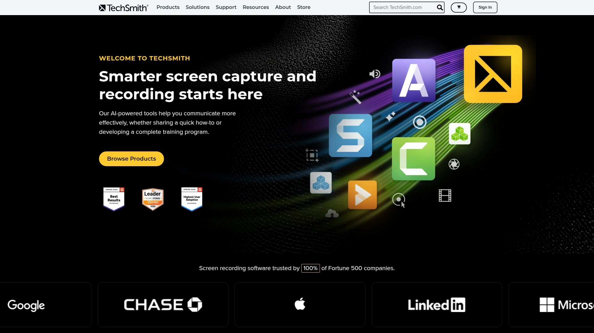
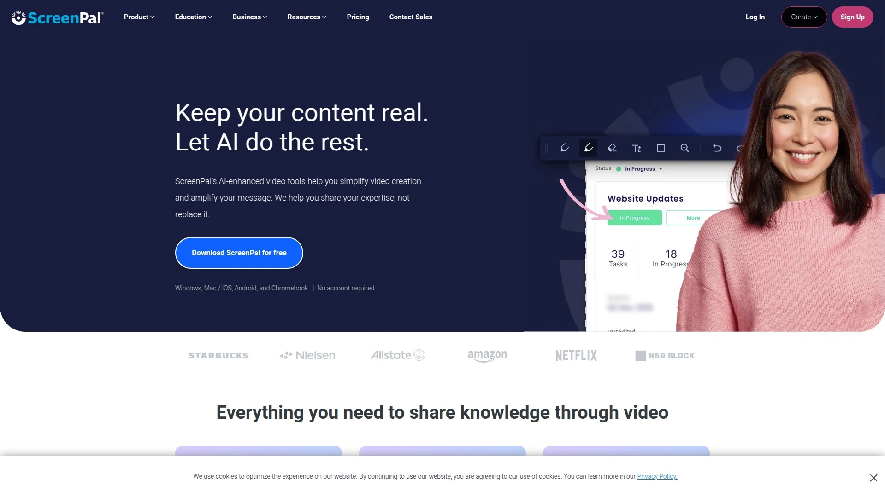
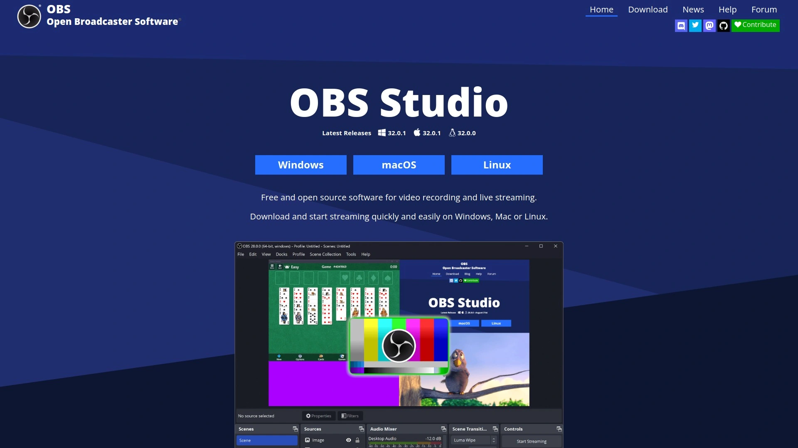
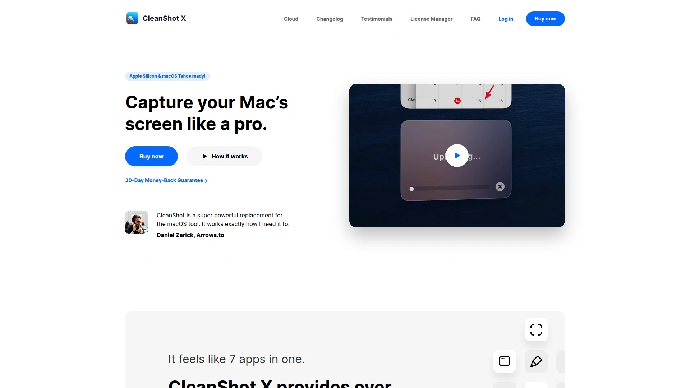

# 2025's Top 7 Best Screen Recording Tools

Recording professional-looking product demos used to mean hiring video editors who charge thousands for what ends up being shaky cursor movements, awkward pauses you can't fix, and zoom effects requiring hours of manual keyframing. Modern screen recording tools automate the polish—smooth cursor tracking, automatic zoom focusing on actions, one-click removal of filler words, and professional animations that transform raw recordings into polished demos instantly.

The best screen recorders combine intelligent automation with editing flexibility, delivering studio-quality tutorials, product demonstrations, and social media content in minutes rather than days, all without requiring video editing expertise or expensive software subscriptions.

***

## **[Screen Studio](https://www.screen.studio)**

Professional screen recorder for macOS with automatic zoom and cinematic animations.

Screen Studio revolutionizes screen recording by automatically creating the visual polish that normally requires hours of tedious video editing work. The platform automatically zooms in on cursor actions, increases cursor size for visibility, and smooths cursor movements that would otherwise look shaky and unprofessional. Thousands of users rely on Screen Studio for recording product demos, online courses, tutorials, and social media content that demands viewer attention.

**Intelligent automatic zoom makes demos easy to follow.** The system detects when you click, type, or interact with interface elements, then automatically zooms to focus viewer attention on those specific actions. This dynamic framing works especially well on smaller mobile screens where viewers struggle to see details in full-screen recordings. When exporting vertical videos for Instagram Reels, TikTok, or YouTube Shorts, Screen Studio automatically adjusts all zoom timings for optimal vertical viewing experiences.

Manual zoom control gives you full creative direction when automatic detection doesn't capture your intent perfectly. Select important screen regions and Screen Studio animates smooth zoom transitions connecting those moments naturally. The timeline-based editing interface lets you drag zooms to different positions, adjust timing, and fine-tune framing without wrestling with complex video editing software. All the heavy computational lifting happens automatically—you focus on identifying key moments while the system handles animation mathematics.

Professional animations apply by default, transforming amateur-looking recordings into polished content indistinguishable from professionally produced videos. Shaky, rapid cursor movement gets replaced with smooth, elegant gliding that looks intentional rather than frantic. After recording finishes, you can change cursor size retroactively, making it larger for clearer visibility or smaller for less distraction. Static cursors automatically hide with beautiful fade animations, and for loopable social media clips, the cursor returns to its starting position near the video's end.

High-quality system cursors replace standard low-resolution pointers with crisp versions that stay sharp even when enlarged significantly. This attention to visual detail elevates your recordings above the pixelated cursors common in budget screen recordings. Complete customization lets you match brand guidelines through adjustable backgrounds, outer spacing, shadows, insets, and other visual elements ensuring every video aligns with your brand identity.

Recording capabilities extend beyond basic screen capture—record webcam overlays, microphone audio, system audio from all applications or specific ones, and even iOS devices connected to your Mac. The webcam overlay intelligently positions itself to avoid covering your cursor while slightly zooming out to maintain full context. Audio enhancement normalizes voice volume automatically and removes background noise without manual EQ adjustments.

Transcript generation happens entirely on your local machine with no data sent to external servers, addressing privacy concerns while creating subtitles you can add to finished videos. System audio recording from selected applications makes tutorial creation simpler when demonstrating software that produces sound. The comprehensive feature set packaged in intuitive interfaces explains why Screen Studio attracts creators who want professional results without professional-level video editing skills.

***

## **[Loom](https://www.loom.com)**

Industry-leading instant video sharing used by 14 million people across 200,000 companies.

Loom dominates the screen recording market by making video creation and sharing ridiculously fast—record your screen, camera, or both, then instantly share via auto-generated link without uploading delays or file management headaches. Over 14 million users across 200,000 companies rely on Loom for asynchronous video communication, demonstrating its reliability and ease-of-use at massive scale.

The one-click recording experience works seamlessly across Mac, Windows, Chrome browser extension, iOS, and Android devices. You click record, capture your message, click stop, and immediately receive a shareable link—the entire process takes seconds rather than minutes spent uploading and downloading files. This speed explains why Loom replaced countless unnecessary meetings, with teams sending quick Looms instead of scheduling 30-minute calls to answer simple questions.

**Engagement features drive meaningful interaction around your videos.** Viewers leave timestamped comments at specific moments, allowing precise feedback rather than vague "around the middle somewhere" references. Emoji reactions let people quickly acknowledge they've watched and understood without requiring verbal responses. Notification systems alert you when someone views, comments, or reacts, creating conversation loops that feel natural despite being asynchronous.

Video quality ranges from 720p in the free tier up to 4K in premium plans, accommodating everything from quick internal updates to polished client presentations. Camera frames, virtual backgrounds, and camera effects like blurring add professional polish to webcam recordings without green screens or complex lighting setups. The editing tools handle trimming, stitching clips, adding text overlays, arrows, and box highlights—all directly in the browser without downloading specialized software.

Integration with workplace tools brings Loom videos directly into Slack, Microsoft Teams, LinkedIn, and Twitter, where they auto-expand with embedded players rather than requiring clicks to external links. This seamless embedding increases view rates significantly compared to links requiring navigation away from familiar platforms. The Google Search indexing option makes your Loom videos discoverable through organic search, extending their reach beyond direct sharing.

Video hosting within Loom HQ provides centralized library management, hashtag organization, and the ability to upload Zoom or Google Meet recordings for searchable archival. The platform essentially serves as your video knowledge base where team members discover relevant content through search rather than asking the same questions repeatedly.

***

## **[Tella](https://www.tella.com)**

AI-powered screen recorder that automatically edits videos before you share them.

Tella differentiates itself through AI-driven automation that handles editing tasks most screen recorders force you to do manually. Record your screen, camera, or both, then let AI automatically cut mistakes, remove silences, eliminate filler words, enhance audio quality using any microphone, add engaging transitions between shots, and generate clickable chapter markers for viewers.

The two-click recording process launches from anywhere on the web via Chrome extension or dedicated Mac/Windows apps. You capture content, and the system uploads instantly to cloud editing—no waiting for massive files to transfer before starting post-production work. The online editor provides cutting, zooming, background additions, and comprehensive video customization without installing bulky desktop software.

**AI features eliminate the tedious parts of video editing.** The AI video editor automatically identifies and removes filler words like "um," "uh," and "you know" that make speakers sound uncertain or unprofessional. Silence removal cuts dead air without you manually scrubbing through timelines hunting for pauses. The AI audio enhancer transforms recordings captured with basic laptop microphones into professional-sounding voiceovers rivaling dedicated audio equipment.

Automatic transitions add shot changes that maintain viewer engagement in longer videos, while AI-generated chapters create clickable sections letting viewers jump directly to topics they care about rather than watching entire recordings searching for relevant moments. Transcription into 90+ languages opens your content to global audiences through accurate subtitle generation.

Segmented recording lets you pause and redo specific portions without restarting from the beginning—crucial when you stumble over words or make mistakes demonstrating software features. Speaker notes display on-screen while recording, helping you stay aligned with scripts without memorizing entire presentations. Pre-recorded footage uploads directly into Tella's editor, letting you polish existing content using the same AI tools.

The 4-in-1 platform handles video messages, short-form social content, long-form courses, and video hosting through one unified workflow. Export finished videos in 4K quality without watermarks, or share instantly as links without file downloads. The aesthetic focus delivers branding options, beautiful backgrounds, and attractive video pages that reflect well on your brand.

***

## **[Camtasia](https://www.techsmith.com)**

All-in-one screen recorder and video editor for professional tutorials and presentations.

Camtasia ranks among the most comprehensive screen recording solutions by combining powerful capture capabilities with professional-grade video editing in one integrated suite. TechSmith designed Camtasia specifically for creating polished tutorials, training videos, presentations, and marketing materials that require more editing sophistication than basic screen recorders provide.

The recording component captures screen activity, webcam feeds, and audio sources simultaneously with configurable quality settings. PowerPoint integration lets presenters initiate recordings directly within PowerPoint, streamlining slide-based presentation capture. The post-capture workflow imports recordings into the full-featured editor where real video production work begins.

Multi-track timeline editing provides granular control over every element—video layers, audio tracks, effects, annotations, and transitions all sit on independent timelines you manipulate separately. This professional workflow accommodates complex editing scenarios like picture-in-picture, B-roll insertions, multiple audio commentary tracks, and synchronized multimedia elements that simpler tools can't handle.

**Template library and effects accelerate production significantly.** Pre-built templates provide starting points for common video types, while professional effects add polish without manual keyframing. Advanced cursor effects make mouse movements more visible and engaging, annotations highlight important screen elements, and green screen removal replaces backgrounds for professional studio looks.

Interactive features differentiate Camtasia from basic recorders—add clickable quizzes, tables of contents with chapter navigation, searchable metadata, and hotspots triggering actions when clicked. These interactive elements transform passive videos into engaging learning experiences, particularly valuable for e-learning and corporate training applications.

Export flexibility supports MP4, WMV, AVI, and animated GIF formats with platform-optimized presets for YouTube, Vimeo, and Screencast. Direct upload capabilities push finished videos to hosting platforms without manual file transfers. The comprehensive feature set comes at premium pricing—$499 annually or one-time purchase—positioning Camtasia as professional tooling rather than casual recording software.

***

## **[ScreenPal](https://screenpal.com)**

Free screen recorder with no time limits and no watermarks across all platforms.

ScreenPal (formerly Screencast-O-Matic) delivers capable screen recording completely free with none of the artificial limitations plaguing other "free" tools. Record unlimited length videos without watermarks, time restrictions, or forced upgrades interrupting your workflow. The platform works across Windows, Mac, Chromebook, iOS, and Android, providing consistent experiences regardless of device.

The straightforward recording interface captures screen, webcam, or both simultaneously with audio from microphone and system sources. Drawing tools let you annotate while recording, highlighting important elements or adding emphasis to demonstrations. Basic editing handles trimming, cutting, and simple adjustments directly in the browser without downloading separate editing applications.

Cloud hosting included in free accounts stores your recordings with shareable links for distribution. Upgrade tiers add features like video editing tools, image capture, GIF creation, and automated captions, but the free version provides genuinely useful functionality without crippling limitations designed to force purchases. This accessibility makes ScreenPal particularly attractive for educators, students, and budget-conscious users needing reliable recording without ongoing expenses.

The cross-platform availability means you record consistently whether working from desktop computers, tablets, or smartphones. This flexibility accommodates mobile workflows and remote scenarios where full desktop access isn't available. While lacking the advanced automation of premium tools, ScreenPal delivers solid fundamentals at an unbeatable price point.

***

## **[OBS Studio](https://obsproject.com)**

Free open-source powerhouse for live streaming and advanced screen recording.

OBS Studio dominates the gaming and live streaming world as the go-to free, open-source solution supporting unlimited simultaneous video sources, real-time audio mixing, advanced scene composition, and plugin ecosystems extending functionality infinitely. While the learning curve intimidates beginners, the power and flexibility justify the investment for users needing professional-grade control.

Scene composition allows layering multiple video sources—screen captures, webcams, images, text overlays, browser windows, and video files—into complex layouts you switch between instantly during recording or streaming. This multi-source capability enables picture-in-picture, side-by-side comparisons, lower thirds, and other professional broadcast techniques impossible with basic single-source recorders.

**Real-time audio mixing handles multiple input sources separately.** Adjust microphone levels, system audio, background music, and alert sounds independently with filters for noise suppression, gate, compression, and EQ. The granular audio control produces broadcast-quality soundtracks without post-production audio editing.

Live streaming integration connects directly to Twitch, YouTube, Facebook Gaming, and custom RTMP servers, making OBS the standard tool for content creators broadcasting to audiences. Recording and streaming simultaneously captures local copies while broadcasting live, providing backup files and highlight reels from streams. The plugin ecosystem adds countless features through community-developed extensions, from enhanced transitions to NDI support for professional video workflows.

The completely free, open-source nature with no paid tiers or feature limitations makes OBS unbeatable value for technically capable users. However, the lack of built-in editing means recorded files require separate video editing software for post-production work. OBS excels at capturing content but isn't an all-in-one solution like Camtasia or Screen Studio.

***

## **[CleanShot X](https://cleanshot.com)**

Best Mac screen recorder with advanced screenshot and annotation capabilities.

CleanShot X delivers the most polished screen recording and screenshot experience specifically optimized for macOS, integrating seamlessly with Mac workflows and design aesthetics. The tool handles both quick screen captures and full recordings while providing annotation, editing, and sharing tools that feel native to the Apple ecosystem.

Recording quality and performance optimize for Mac hardware, taking advantage of Apple Silicon efficiency and macOS-specific APIs other cross-platform tools can't leverage. Screen recordings capture at high frame rates without the performance degradation common when using resource-intensive recording software during demanding workflows. The native Mac app feels faster and more responsive than Electron-based cross-platform alternatives.

Advanced screenshot capabilities go beyond basic screen grabs—capture scrolling content, annotate with arrows and text, add backgrounds, hide desktop clutter, and customize every visual aspect. The annotation tools work for both screenshots and video frames, providing consistent editing experiences across media types. Cloud upload integration shares captures instantly with short links rather than forcing manual file transfers.

The focus on Mac users means CleanShot X doesn't support Windows or Linux, but that platform specificity enables optimization and integration impossible in cross-platform tools. For Mac-only workflows prioritizing performance and native design, CleanShot X delivers the best recording experience available at reasonable subscription pricing well below premium cross-platform solutions.

***

## FAQ

**What makes modern screen recorders better than just recording with built-in system tools?**

Modern screen recorders like Screen Studio automatically add professional polish—smooth cursor movements, intelligent zoom focusing on actions, audio enhancement removing background noise, and automated editing that cuts silences and filler words. Built-in system tools (like macOS Screenshot or Windows Game Bar) capture raw footage requiring hours of manual editing to look professional. Advanced recorders compress weeks of video editing expertise into automatic features that run while you record, delivering polished results instantly rather than forcing post-production work.

**Can these screen recording tools actually replace expensive video production for product demos?**

Yes, tools like Screen Studio, Tella, and Loom specifically target product demo creation by automating the visual effects, cursor enhancements, and editing polish that previously required hiring video editors. Companies save thousands per demo by recording internally with automatic zoom, smooth animations, and professional effects applied in real-time. The quality rivals traditionally produced demos for most use cases, with the added benefit of allowing rapid iteration and updates impossible when relying on external production teams.

**What's the difference between screen recorders focused on speed versus editing capabilities?**

Speed-focused tools like Loom prioritize instant recording and sharing—you capture, get an immediate link, and move on without editing. They work perfectly for quick team updates, async communication, and situations where speed matters more than polish. Editing-focused tools like Camtasia and Tella provide comprehensive post-production capabilities for creating refined courses, tutorials, and marketing content requiring multiple takes, effects, and careful editing. Choose based on whether you need fast communication or polished final products.

---

## Conclusion

The right screen recording tool transforms how you create product demos, tutorials, and video content by automating the tedious editing work that traditionally consumed hours after every recording session. These seven platforms eliminate the friction between capturing your screen and sharing polished videos that actually hold viewer attention through professional animations, intelligent zoom, and automated enhancements. [Screen Studio](https://www.screen.studio) particularly excels for Mac users creating product demos, tutorials, and social media content who want cinema-quality automatic animations, smooth cursor movements, and intelligent zoom that makes recordings engaging without spending hours in video editing software learning complex techniques.
